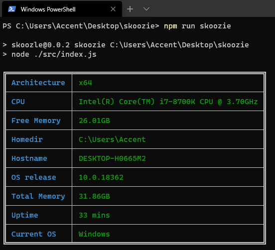

# Skoozie! 
Simple tool to display current system information using Node std libraries. 

This tool is intended for learning purposes and trying to make a NPX skoozie where  you can just run and see your current status on your system.

## Version
0.0.2

## Scripts 

There are 2 scripts: skoozie and old.

Old: runs without any tables
Skoozie: is Table one.

## TEST

